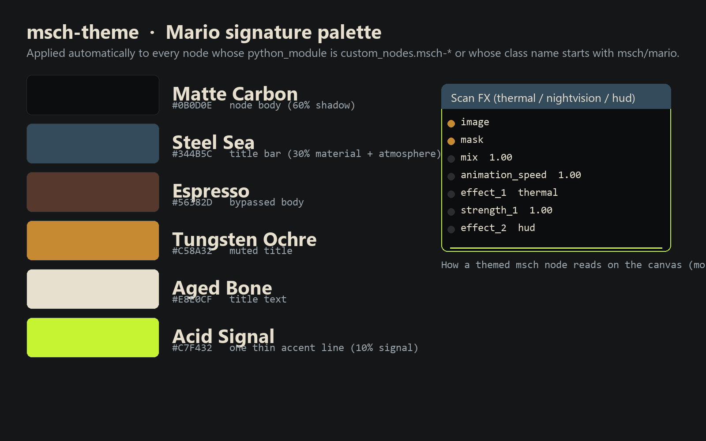

# MSCH Theme showcase

Examples supplied by Mario from the MSCH Node Showcase collection. The output files are preserved as supplied.

The supplied palette card illustrates the theme colors and a mock-up of a themed node. It is not a screenshot of the live ComfyUI interface.

## Gallery

Click a video preview to open its file on GitHub, or use the download link.

## Still images and diagnostic outputs

### Msch theme palette card

## Source notes

The collection notes identify images from the Jim Morrison image library, Mario’s clips, and the Suno track “Crushing Syncopation”. Those source assets are not included separately. The rendered media is supplied as showcase material; the repository’s MIT license describes the node code and does not establish a separate license for underlying media.
